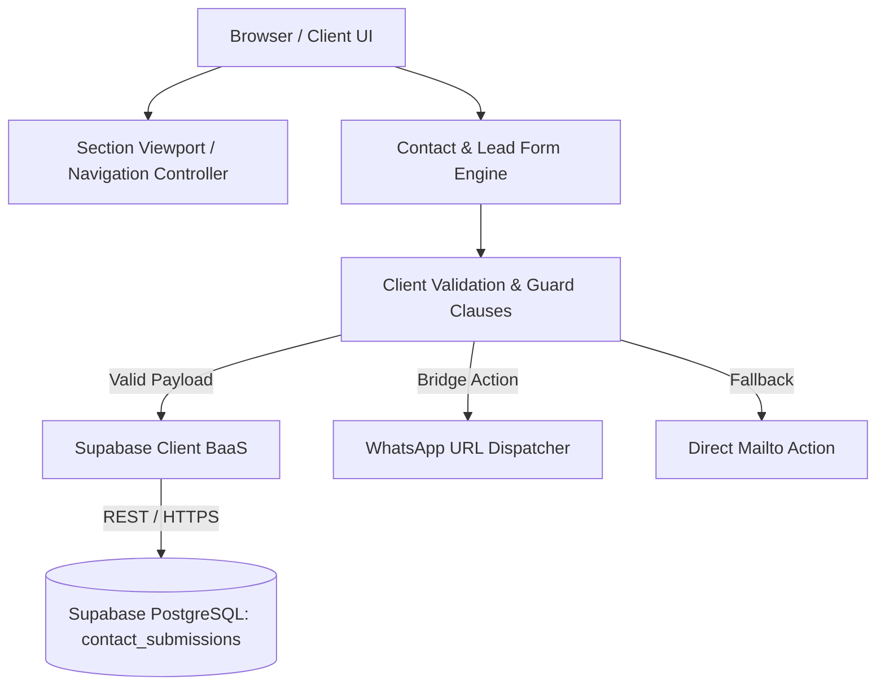

# Architecture Specification

## 1. System Overview
`devsurmesure` (Portfolio & Digital Showcase for Hicham Aitsaid — Software Engineer & Health-Tech Specialist) is architected as a high-performance, responsive, accessible, and reactive client application with backend-as-a-service (Supabase) integration and external webhook/messaging bridges.



---

## 2. Directory & Component Architecture

```
devsurmesure/
├── index.html             # Semantic DOM structure, SEO metadata, JSON-LD schema
├── style.css              # Design system tokens, layout, typography, micro-interactions
├── main.js                # Core runtime logic, scroll observer, form handling, BaaS bridge
├── package.json           # Project metadata and runtime scripts
├── assets/                # Media assets, brand identity, profile imagery
├── Architecture.md        # Technical architecture, system diagrams, data flow
├── design.md              # Design system, UX guidelines, typography, color tokens
├── prd.md                 # Product Requirements Document, user stories, acceptance criteria
├── phases.md              # Phased implementation roadmap & progress tracker
├── rules.md               # Coding standards, guard clause rules, quality control
└── memory.md              # Single source of truth for decisions, history & changelog
```

---

## 3. Component Architecture & Responsibilities

### 3.1. Navigation & Ambient Header Controller
- **Module**: `FloatingNavPill`
- **Responsibilities**:
  - Intersects with light/dark section boundaries via `IntersectionObserver` / bounding coordinates.
  - Dynamically flips between light and dark pill states (`theme-dark-nav`).
  - Provides instant status indicator (`Disponible` pulse).

### 3.2. Section Hierarchy
1. **Top Veil & Ambient Light**: Subtle gradient depth layer.
2. **Hero Section**: High-impact value proposition, CTA buttons, status pill, terminal preview / proof chips.
3. **Core Pillars & Expertise**: Health-Tech, Fullstack Web Engineering, E-commerce / PrestaShop Architecture.
4. **Selected Projects (`#work`)**: Interactive case studies, live demo links, technical stack tags, metrics.
5. **Engineering Methodology (`#method`)**: Step-by-step development lifecycle (Audit, Architecture, Build, Security).
6. **Pricing & Engagements (`#pricing`)**: Transparent service tiers and fixed/TJM pricing scopes.
7. **About & Background (`#about`)**: Academic credentials, biomedical engineering synergy, software craftsmanship.
8. **Contact & Acquisition Engine (`#contact`)**: Validated lead form with dual-channel persistence (Supabase + WhatsApp).
9. **Footer**: Social profiles, legal notices, copyright.

### 3.3. Data & State Management
- **Local Reactive State**: Minimal zero-dependency state machine for UI interactions (scroll position, mobile menu toggle, form submission status).
- **Persistence Layer**: Remote PostgreSQL table via Supabase JS SDK (`contact_submissions` table) with Row Level Security (RLS) policies allowing anonymous inserts.
- **External Communications**: Direct URI scheme encoding for WhatsApp Web/App (`wa.me`) and standard mailto fallback.

---

## 4. Non-Functional Requirements & Security
- **Strict Type Checking & Guard Clauses**: All input handlers evaluate state with early returns.
- **Content Security & Sanitization**: Form inputs sanitized before payload dispatch.
- **Zero-Dependency Core**: Pure Vanilla JS, semantic HTML5, and CSS3 for zero build friction, maximum speed (<100ms TTI), and 100/100 Lighthouse performance.
- **Accessibility (a11y)**: WCAG 2.1 AA compliance with aria-labels, semantic landmarks, and high-contrast color ratios.
